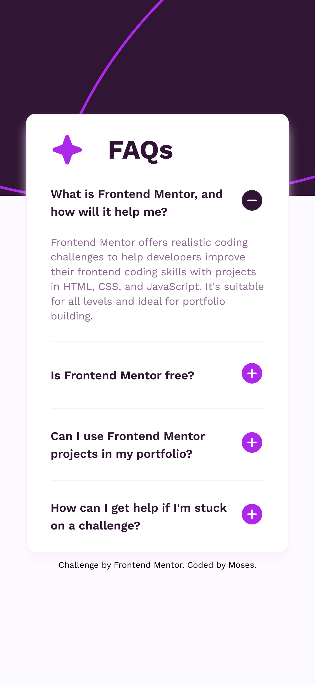

# Frontend Mentor - FAQ accordion solution

This is a solution to the [FAQ accordion challenge on Frontend Mentor](https://www.frontendmentor.io/challenges/faq-accordion-wyfFdeBwBz). Frontend Mentor challenges help you improve your coding skills by building realistic projects.

## Table of contents

- [Overview](#overview)
  - [The challenge](#the-challenge)
  - [Screenshot](#screenshot)
  - [Links](#links)
- [My process](#my-process)
  - [Built with](#built-with)
  - [Useful resources](#useful-resources)
- [Author](#author)
- [Acknowledgments](#acknowledgments)

**Note: Delete this note and update the table of contents based on what sections you keep.**

## Overview

### The challenge

Users should be able to:

- Hide/Show the answer to a question when the question is clicked
- Navigate the questions and hide/show answers using keyboard navigation alone
- View the optimal layout for the interface depending on their device's screen size
- See hover and focus states for all interactive elements on the page

### Screenshot

### Links

- Solution URL: [faq-accordion-main](https://github.com/mbtenkorang/faq-accordion-main)
- Live Site URL: [faq-accordion-site](https://your-live-site-url.com)

## My process

### Built with

- Semantic HTML5 markup
- Mobile-first workflow
- [Vue](https://vuejs.org/) - JS Progressive frameword
- [Tailwindcss](https://tailwindcss.com/) - For styling
- [Vite](https://vitejs.dev/) - For bundling
- [PNPM](https://pnpm.io/) - For package management

## Author

- Website - [Moses](https://github.com/mbtenkorang)
- Frontend Mentor - [@moses](https://www.frontendmentor.io/profile/mbtenkorang)
